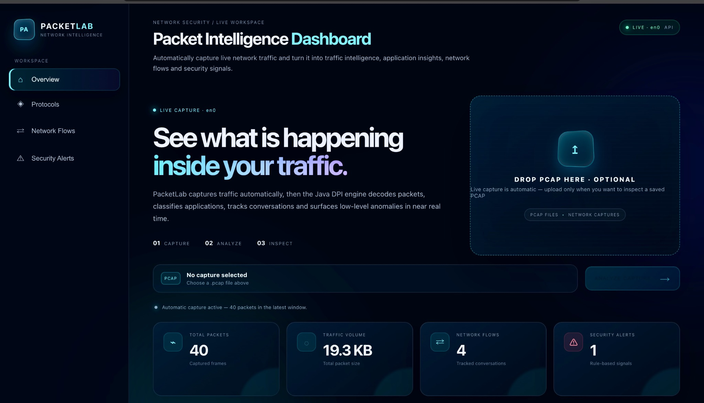
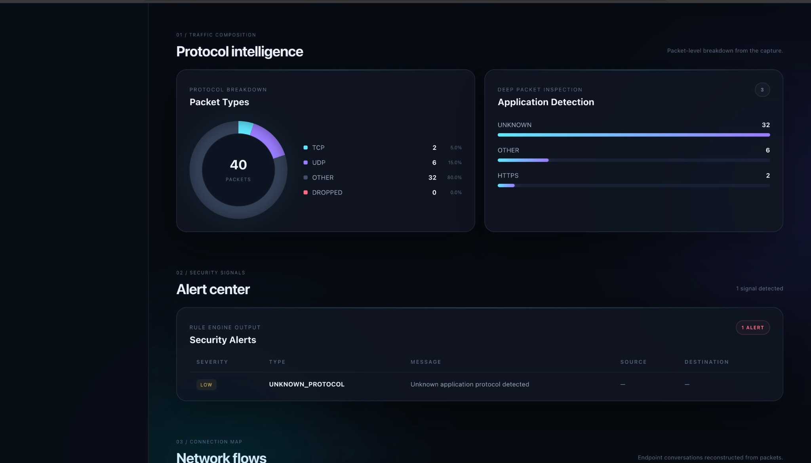
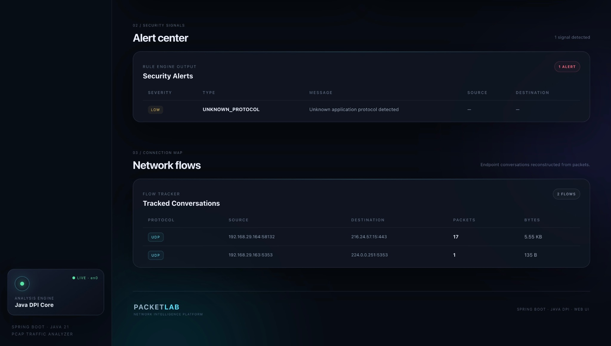

# PacketLab — Network Intelligence & Packet Analyzer

PacketLab is a Java/Spring Boot network packet analysis platform that captures network traffic, performs packet-level inspection, detects applications, reconstructs network conversations, and surfaces security signals through a modern web dashboard.

It supports **automatic live packet capture** for local environments and **`.pcap` upload analysis** as a fallback for hosted/cloud environments where raw packet capture is restricted.

---

## Dashboard

### Overview

PacketLab provides a live network intelligence workspace with automatic capture, packet statistics, traffic volume, tracked flows, and security alerts.



### Protocol Intelligence & Application Detection

The protocol view breaks captured traffic into TCP, UDP, other packets, and dropped packets. The DPI layer also attempts to identify applications such as HTTPS and reports unknown or other traffic.



### Security Alerts & Network Flows

PacketLab reconstructs endpoint conversations from captured packets and presents rule-based security signals alongside source and destination information.



---

## Features

- **Automatic live packet capture**
- **Java-based deep packet inspection (DPI)**
- TCP / UDP / other packet classification
- Application/protocol detection
- Network flow and conversation tracking
- Security alert generation
- Packet count and traffic-volume statistics
- Manual `.pcap` upload and analysis
- REST API for analysis and live-status data
- Modern responsive dashboard UI
- Cross-platform design for macOS, Linux, and Windows
- Cloud deployment support with PCAP-upload fallback

---

## How PacketLab Works

```text
Network Traffic
      │
      ▼
Packet Capture
(tcpdump / dumpcap)
      │
      ▼
Temporary PCAP Window
      │
      ▼
Java DPI Engine
      │
      ├── Packet Classification
      ├── Application Detection
      ├── Flow Reconstruction
      └── Security Rules
      │
      ▼
REST API
      │
      ▼
PacketLab Web Dashboard
```

For local environments, PacketLab captures traffic automatically and continuously analyzes small packet windows.

For hosted environments where raw packet capture is unavailable, users can upload a saved `.pcap` file and run the same Java analysis pipeline.

---

## Technology Stack

### Backend

- Java 21
- Spring Boot
- Maven
- REST APIs
- Java packet-analysis / DPI engine

### Packet Capture

- `tcpdump` / libpcap on Linux and macOS
- `dumpcap` on Windows
- Automatic network-interface detection

### Frontend

- HTML5
- CSS3
- JavaScript
- Responsive dashboard UI

### Deployment

- Docker
- Render-compatible configuration
- GitHub Actions / Maven testing workflow

---

## Requirements

### Local Development

Install:

- Java 21+
- Maven 3.9+
- Packet capture utility:
  - macOS/Linux: `tcpdump`
  - Windows: `dumpcap`

Root/administrator privileges may be required for live packet capture depending on the operating system and network interface.

---

## Running PacketLab

### macOS

From the project directory:

```bash
cd ~/Downloads/packet-analyzer
scripts/run-macos.command
```

Then open:

```text
http://localhost:8080
```

PacketLab automatically detects the default network interface and starts live capture when permissions allow it.

### Windows / Linux

Start the Spring Boot application with Maven:

```bash
mvn spring-boot:run
```

Then open:

```text
http://localhost:8080
```

The capture backend automatically selects the appropriate supported capture mechanism.

---

## Automatic Live Capture

Automatic live capture is the default mode.

PacketLab:

1. Detects the operating system.
2. Detects the default network interface.
3. Starts the appropriate capture tool.
4. Collects a small packet window.
5. Writes the capture to a temporary PCAP file.
6. Sends the PCAP through the Java DPI pipeline.
7. Updates packet, protocol, application, flow, and security information.
8. Repeats the process continuously.

The default configuration analyzes **40 packets per capture window**.

---

## Manual PCAP Analysis

PacketLab also supports saved PCAP files.

Use the dashboard upload area to select a `.pcap` file. The backend sends the file through the same Java analysis pipeline used for captured traffic.

This is useful for:

- Testing
- Replaying captures
- Debugging
- Offline analysis
- Hosted deployments
- Environments where live capture is restricted

---

## Cloud / Hosted Deployment

Raw packet capture is fundamentally different in a hosted web service.

A cloud container generally cannot inspect the visitor's laptop, Wi-Fi traffic, or arbitrary network traffic outside its own network namespace. In addition, cloud platforms may restrict the privileges required to create raw packet sockets.

Therefore PacketLab uses a practical architecture:

```text
LOCAL ENVIRONMENT
Automatic Live Capture
        │
        ▼
Java DPI Analysis
        │
        ▼
Dashboard


CLOUD / HOSTED ENVIRONMENT
        │
        ▼
PCAP Upload
        │
        ▼
Java DPI Analysis
        │
        ▼
Dashboard
```

This keeps the live-capture experience available locally while preserving the full analysis workflow for a public hosted demo.

---

## Configuration

The main capture configuration is stored in:

```text
src/main/resources/application.properties
```

Example:

```properties
server.port=${PORT:8080}
server.address=0.0.0.0

packetlab.capture.enabled=true
packetlab.capture.packets-per-window=40
packetlab.capture.interface=auto
packetlab.capture.tool=auto
packetlab.capture.environment=auto
```

---

## REST API

Important endpoints include:

| Endpoint | Purpose |
|---|---|
| `GET /api/health` | Application health check |
| `GET /api/live` | Live capture status and latest analysis |
| `POST /api/analyze-pcap` | Analyze an uploaded PCAP file |

The frontend polls the live-status endpoint to keep the dashboard updated.

---

## Project Structure

```text
packet-analyzer/
├── src/
│   ├── main/
│   │   ├── java/
│   │   │   └── ...
│   │   └── resources/
│   │       ├── application.properties
│   │       └── static/
│   │           ├── index.html
│   │           ├── style.css
│   │           └── app.js
│   └── test/
├── docs/
│   └── screenshots/
│       ├── dashboard-overview.jpeg
│       ├── protocol-intelligence.jpeg
│       └── network-flows.jpeg
├── scripts/
├── Dockerfile
├── render.yaml
├── pom.xml
└── README.md
```

---

## Testing

Run the complete Maven test suite:

```bash
mvn clean test
```

The project includes automated tests covering the core analysis and application behavior.

---

## Privacy & Capture Safety

Packet capture can contain sensitive information.

Use PacketLab only on networks and systems where you have permission to inspect traffic.

Captured PCAP files may contain:

- IP addresses
- Ports
- Protocol metadata
- Application information
- Network conversation details
- Other packet-level information

Avoid uploading confidential captures to public or third-party environments.

---

## Why PacketLab?

PacketLab combines a backend packet-analysis engine with a visual network-intelligence dashboard.

Instead of displaying raw packet data alone, it turns traffic into higher-level information:

**Packets → Protocols → Applications → Flows → Security Signals**

This makes the project useful as a practical demonstration of:

- Java backend development
- Spring Boot REST APIs
- Network programming
- Packet analysis
- Deep packet inspection
- Security monitoring concepts
- Frontend engineering
- Docker deployment
- Cross-platform system integration

---

## Resume Description

> **PacketLab — Network Intelligence & Packet Analyzer:** Built a Java 21/Spring Boot network analysis platform with automatic live packet capture, deep packet inspection, protocol and application detection, network-flow reconstruction, rule-based security alerts, PCAP upload analysis, and a responsive real-time web dashboard.

---

## Project Goal

PacketLab is designed to demonstrate how low-level network packets can be transformed into useful, human-readable network intelligence through a combination of packet capture, Java-based analysis, REST APIs, and a modern visualization layer.
